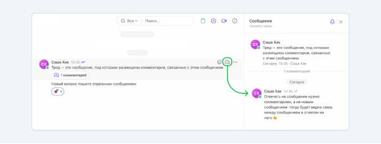

![ref1]

` `**[Яндекс.Практикум] Продакт-менеджер. Все части (2023)**

**Модуль 1. Рынок и бизнес-модель**

01\_Онбординг

01\_Структура программы — Яндекс Практикум

**Структура программы**

Спасибо! Я здесь, чтобы помочь и предоставить информацию. Расскажи, что интересует тебя.

Спасибо за ваши ответы! Мы будем периодически запрашивать вашу обратную связь о курсе и статус ваших целей. Ваши отзывы важны для нас, чтобы понять, нравится ли студентам учиться. Впереди пять месяцев обучения, где вам предстоит изучить как новые, так и знакомые темы. У каждого студента свой опыт, и важно помнить, что даже очевидные вещи могут иметь свои нюансы. Расскажите мне всё!

**Маршрут обучения**

Курс состоит из пяти модулей. В каждом модуле нужно изучить теорию, участвовать в воркшопах и выполнять проектные работы. В конце курса необходимо защитить дипломную работу.

Модуль состоит из двух спринтов, каждый длится две недели. В конце каждого спринта нужно сдавать проект, то есть две сдачи за модуль.

Каждое задание может проходить несколько итераций проверки: отправка ревьюеру, проверка, возврат с комментариями и доработка.

**Воркшопы**

На каждого спринта планируется одна или две онлайн-встречи для практики и вопросов. Они проходят вечером и длятся 2-2,5 часа. Расписание предоставит куратор. 

Дедлайны уточни у куратора.

|1|2|
| :- | :- |
|2|3|
|||

**Дедлайны**

Дедлайны помогают тебе учиться последовательно. В Практикуме есть два типа дедлайнов: мягкий и жёсткий. Мягкий дедлайн — это идеальный срок для сдачи проектных работ, который не блокирует прохождение модуля. Жёсткий дедлайн — последний срок для сдачи работы, после которого следующий модуль будет недоступен. Соблюдение дедлайнов помогает усвоить материал и избежать выгорания. Если возникают сложности, можно отложить дедлайн, перейдя в другую когорту. Переход — это возможность вернуться к учёбе или отложить дедлайн из-за обстоятельств.

|1|2|
| :- | :- |
|2|3|
|||

**Переход**

Мы понимаем, что совмещать учёбу с работой и делами сложно. Ты можешь подать заявку на переход в другую когорту, чтобы продолжить учёбу с новой группой и куратором. Это поможет тебе закрыть "долги" и вернуться к обучению. Переход можно оформить только один раз и использовать для отсрочки дедлайна или ликвидации отставания.

Если нужно отложить дедлайн, мы подберём ближайшую когорту. Если ты отстал от программы, можно выбрать группу, которая сейчас проходит те же темы. Доступ к материалам остаётся, и ты можешь общаться с куратором.

Чтобы подать заявку, выбери "Поменять когорту" в профиле. Куратор рассмотрит её и уведомит тебя. Чаще всего перехода не хватает тем, кому курс неинтересен или кто не может регулярно заниматься. В таких случаях лучше прервать обучение и оформить возврат.

Если ты уже использовал попытку, но уверен в успехе следующего перехода, свяжись с куратором для обсуждения ситуации. Эти правила помогают понять серьёзность намерений. Мы обещаем научить тебя, а ты — прикладывать усилия.

Александр
А можно карту?

**Общая карта**

Твой маршрут включает ключевые активности.

Если что-то будет непонятно, обращайся к куратору. Ты узнаешь, кто это, на следующем уроке.

02\_Команда и коммуникация — Яндекс Практикум

**Команда и коммуникация**

Мы уже говорили о команде сопровождения, и теперь расскажем подробнее о тех, кто будет с тобой на образовательном пути.

**Куратор**

Куратор отвечает за организационные вопросы, такие как помощь с проблемами входа в личный кабинет, информацией о воркшопах и академических отпусках. Он не является экспертом в продакт-менеджменте, поэтому не сможет помочь с расчетами метрик или проведением интервью. Однако куратор может предложить решения, если важные мероприятия совпадают с дедлайнами.

**Наставник**

Наставник — ваш проводник в практической работе. Это опытный продакт-менеджер, который ответит на вопросы по теории и заданиям, расскажет о практическом применении знаний и поддержит в трудные моменты. Он также поможет выстроить эффективную коммуникацию с другими студентами, которые могут стать вашими коллегами.

**Ревьюер**

Ревьюер — опытный продакт, который проверяет твои проекты, оставляя комментарии для улучшения. Обычно требуется до трех проверок. После каждой проверки можно задавать вопросы и обсуждать неясные моменты. Ревьюер не отвечает на организационные вопросы и не объясняет теорию.

**Служба поддержки**

Служба поддержки доступна круглосуточно через чат в правом нижнем углу экрана. Вы можете написать им, если понадобиться помощь с доступом, тренажёром или навигацией.

**«Пачка»**

Комьюнити Практикума находится в мессенджере «Пачка», где проходят личные и групповые чаты для обучения. Доступна мобильная, десктопная версия и веб-интерфейс, который наиболее стабильный. Правильно задавая вопросы в общем чате, ты получишь поддержку и советы от однокурсников. Мы подготовили краткую инструкцию для удобного освоения «Пачки».

**Оформление профиля**

Заполни профиль в «Пачке»: добавь аватарку с фото и укажи имя и фамилию на русском.

**Треды**

В «Пачке» сообщения организованы в треды, где комментарии связаны с основным сообщением. Ответы должны быть комментариями, а не новыми сообщениями. Можно редактировать любые сообщения, но удалять нельзя. Главное правило: новый вопрос — отдельное сообщение, ответ — в комментариях. Тред можно комментировать, сохранять, пересылать и отмечать смайликами.

Чтобы упомянуть пользователя в треде, поставьте символ @, начните вводить имя и выберите его из подсказки. После отправки сообщения он получит уведомление.

**Личные сообщения, диалоги**

«Пачка» позволяет отправлять личные сообщения, доступные только получателю. Чтобы начать диалог с участником, нажми на его имя и выбери «Перейти в диалог».

Найди раздел «Личные сообщения» слева, нажми на лупу и введи имя человека для поиска.

**Чего лучше не делать в личных сообщениях**

Не пишите просто «Привет!» и не ждите ответа; лучше сразу формулируйте свою просьбу или вопрос. В личных сообщениях используйте основную ветку чата, чтобы ответы не затерялись.

**Как отправить картинку?**

Способы добавить картинку:
1\. Перетащи в «Пачку».
2\. Вставь из буфера (Ctrl+C → Ctrl+V).
3\. Выбери, нажав «+» слева от окна сообщения.

**Поиск в «Пачке»**

Не трать время на ленту в «Пачке» — ищи информацию через поисковую строку в верхнем левом углу.

**Ключевые беседы в «Пачке»**

Канал #info предназначен для важных анонсов и сообщений о технических работах. Здесь публикуются объявления куратором и наставником, а вопросы можно задавать в комментариях.

Канал #grouplab служит для обсуждения теории и практики. Здесь студенты могут задавать вопросы наставнику, предварительно проверив, не было ли уже задано подобное. Вопросы должны быть четкими, а обсуждения происходят только в общих чатах.

Канал #library — место для обмена полезными ссылками. Все могут делиться материалами, добавляя к ним описание. Поддерживайте авторов, оставляя комментарии или ставя смайлики.

Канал #teamwork предназначен для неформального общения. На вопросы по учебному материалу наставник не отвечает — для этого используйте #grouplab.

**О пользе для учёбы**

Чтобы разобраться в чем-то, расскажи об этом другому. Помогая другим, ты развиваешься сам. Но не делись своей проектной работой — каждый должен учиться на своих ошибках. Не путай самостоятельность с одиночеством. Если не удаётся найти ответ, обращайся за помощью к единомышленникам и наставникам. Это нормально. Задавая вопрос, ты помогаешь и другим учиться.

# Сдача проектной работы 6

Поздравляем с завершением темы! Пришло время сдавать проектную работу. Проверь себя по чек-листу: 

\- Файлы Miro и Google Таблицы доступны для просмотра и редактирования.
\- Все блоки задания заполнены.
\- Ответы развёрнуты и соответствуют вопросам.

Если всё готово, отправляй ссылку на работу!

Воркшопы

Видео GMT20230801-162652\_Recording\_1832x946

Конспект видео воркшопа по продукт-менеджменту:

**Введение**

- Участники приветствуют друг друга и ожидают начала воркшопа.
- Обсуждаются технические моменты, такие как запись события и проблемы с интернетом.

**Цель воркшопа**

- Главной темой встречи являются user flow и прототипирование.
- Участникам предстоит работать над созданием user flow и прототипов для приложения "Маленький театр".

**Программа воркшопа**

1. **Разделение на группы**: Участники будут работать в командах над постройкой user flow.
1. **Работа на доске**: Использование доски Miro и библиотеки wireframe для прототипирования.
1. **Время работы**: На воркшоп запланировано 2 часа с перерывом.

**Задачи**

- Команды должны разработать функциональность "детский режим" для приложения.
- Указаны 4 user story, на основе которых команды должны создать user flow:
  - Родитель хочет ограничить контент.
  - Родитель хочет видеть всю историю просмотра.
  - Родители хотят выбирать контент для детей.
  - Родители хотят видеть, какие фильмы нравятся ребенку.

**Теоретические основы user flow**

- User flow - это диаграмма, которая показывает путь пользователя через приложение, включая все действия и переходы между экранами.
- Он может представлять последовательность действий, например, от главного экрана до экрана оплаты.
- Важность ясной визуализации путей, где головные экраны и действия четко обозначены.

**Обсуждение прототипов**

- Выбор уровня проработки прототипов: low-fi, mid-fi.
- Реализация mid-fi прототипов, которые позволят быстро представить задумку и структуру приложения.
- Дизайнеры и продакт-менеджеры должны вместе работать над созданием и идеями функционала прототипов.

**Работа в группах**

- Участники разделяются на группы и приступают к созданию своих user flow и прототипов.
- Каждая группа обсуждает свои идеи, визуализирует их и получает обратную связь от других команд.

**Презентация результатов работы**

- Каждая команда представляет свой user flow и прототипы.
- Участники обсуждают достоинства и недостатки представленных решений, делятся комментариями и идеями по улучшению.

**Заключение**

- Итоги воркшопа: участники получили опыт в создании user flow и прототипов, научились работать в командах.
- Открытая дискуссия о процессе прототипирования и опыте, полученном на воркшопе.
- Участники завершают встречу с пониманием ключевых аспектов проектирования пользовательских потоков и прототипирования.

**Выводы**

- Употребление правильных терминов, визуализация действий пользователей и создание понятных дизайнов — ключ к успешной разработке продукта.
- Обладание навыками работы с user flow и прототипами критично для продакт-менеджеров и дизайнеров.

Видео video1919858031

Конспект воркшопа "Продакт менеджер" из курса Яндекс.Практикум:

**1. Обсуждение пользовательского пути**

**а. Обсуждение ограничения путей пользователя**

- Участник поднимает вопрос о том, как ограничить доступ ребенка к определенным функциям приложения.
- Основная задача заключается в том, чтобы родители могли установить ограничения на пути, по которым может проходить пользователь (в данном случае ребенок).

**б. Задачи приложения**

- Участник обсуждает, что основной задачей является удобство и ограничение доступа к контенту для детей.
- Идея заключается в том, чтобы предусмотреть возможность перехода родителя в детский раздел приложения.

